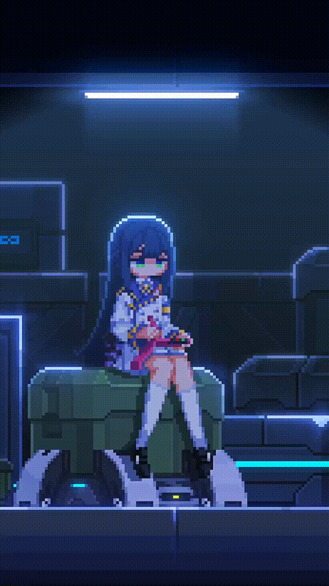

<h1 align="center">Hello there!  👋</h1>

<picture>
  
</picture>

I'm **ARTSPRN**, a passionate first-year student at ITMO University's Faculty of Information Technologies and Programming. 

- 🌱 Actively sharpening my skills in **C, C++, and C#**.
- 💡 Enthralled by **Software Engineering** and **Unity 3D**, with a keen focus on **backend** and **game development**.
- 🤝 Open to collaborating on exciting student projects and open-source initiatives.
- 🎯 Always eager to conquer new challenges and contribute to meaningful projects.
- 📫 Get in touch via email: [artyom-suprun-yndx@ya.ru](mailto:artyom-suprun-yndx@ya.ru) or connect on [Telegram](https://t.me/softduckling).

**Fun Fact:** Kittens start purring just a few days after birth, even when their eyes are still closed. This is not just a sign of contentment — the vibrations from purring can promote tissue healing and strengthen the immune system. So this cute sound helps them cope with the early difficulties in life!

  

